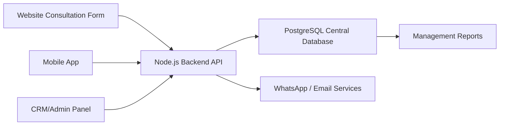

# CRM Requirements Document (SRM/SRS)

Project: Bhawani Fitness / Central Management CRM  
Backend: Node.js API with PostgreSQL  
Purpose: Store website, mobile app, sales, finance, client, and team operations data in one central system.

## 1. Objective

The CRM will act as the single management system for leads, clients, payments, quotations, invoices, staff work, project progress, support requests, and reports. Data coming from the website and mobile app must be captured in one backend so the management team can track the complete journey from first enquiry to onboarding, payment, live sessions, support, and retention.

## 2. User Roles

- Super Admin: Full system access, settings, users, reports, finance, and audit logs.
- Sales Admin: Lead management, hot/cold calls, follow-ups, quotations, and conversion status.
- Finance / CA: Payment tracking, invoice status, month-end billing, tax summary, and exports.
- Project Manager / Operations Manager: Staff assignment, project/client progress, reports, and daily work status.
- Developer / Trainer / Staff: Assigned users or projects, daily progress updates, report uploads, and task status.
- Support Executive: User issue history, support tickets, chat status, and resolution tracking.
- Client / App User: Mobile app access, consultation request, subscription/session details, support and progress updates.

## 3. Core CRM Modules

### 3.1 Client Details

The system must store complete client information including name, phone, email, country, city, condition/concern, source, assigned staff, status, onboarding date, payment status, and activity history.

Required fields:

- Client name
- WhatsApp number
- Email
- Country and city
- Source: Website, App, Instagram, Referral, Manual Entry
- Primary concern: Fertility, Pregnancy, PCOS/PCOD, Low AMH, Blocked Tubes, Male Fertility, Other
- Assigned sales executive
- Assigned trainer or support staff
- Status: New, Contacted, Hot, Cold, Follow-up, Converted, Not Interested, Onboarded
- Notes and activity timeline

### 3.2 Lead and Call Management

All website and app enquiries must enter the CRM as leads. Sales users should be able to classify leads as hot or cold, add call notes, schedule follow-ups, and track conversion.

Workflow:

1. Lead created from website popup, mobile app, or manual entry.
2. Sales team calls or WhatsApps the lead.
3. Lead is marked Hot, Cold, Follow-up, Converted, or Lost.
4. Follow-up reminders are scheduled automatically.
5. Conversion analytics are shown to management.

### 3.3 Payment Details

Payment data must be tracked as received or pending. Finance should be able to view partial payments, pending amount, due date, invoice relation, and client payment history.

Payment status:

- Pending
- Partially Received
- Received
- Failed
- Refunded

### 3.4 Quotation Module

The CRM should allow creating quotations for clients or projects. Tax calculation must support CGST + SGST or IGST, with default total GST as 18%.

Quotation output:

- PDF download
- CSV export
- WhatsApp share
- Email share

Quotation status:

- Draft
- Sent
- Accepted
- Rejected
- Converted to Proforma Invoice

### 3.5 Proforma Invoice

Accepted quotations can be converted into proforma invoices. Proforma invoice should include client details, services, amount, GST, due date, terms, and payment link/reference.

### 3.6 Invoice Module

Final invoices should be generated after payment confirmation or as per finance rules.

Invoice actions:

- Generate PDF
- Send on WhatsApp
- Send by email
- Mark as sent
- Mark as paid
- Export for CA

### 3.7 Staff Pipeline

The CRM should track staff work pipeline weekly and monthly. Managers should be able to see who is assigned to which client/project and what work is pending.

Pipeline fields:

- Staff name
- Department
- Assigned clients/projects
- Monday weekly plan
- Daily progress
- Pending work
- Completed work
- Manager remarks

### 3.8 Project / Work Tracking

For internal projects or client delivery, the CRM should include project tracking.

Project workflow:

1. Create project with client details.
2. Assign project manager.
3. Assign developers, trainers, or staff.
4. Add tasks and milestones.
5. Upload reports or documents.
6. Track progress percentage.
7. Add internal delivery links such as GitHub, Drive, or web app preview.
8. Maintain work tracking logs.

Important rule: GitHub or delivery links must be visible only to internal employees with permission.

### 3.9 Report Upload

Staff should be able to upload progress reports, client reports, medical/lifestyle documents, project reports, and finance documents depending on access level.

Report status:

- Uploaded
- Reviewed
- Approved
- Needs Correction

### 3.10 Support and Issue History

Support panel must show complete issue history for every user.

Support fields:

- Issue category
- Priority
- Description
- Assigned support executive
- Status
- Resolution note
- Created date
- Closed date

### 3.11 Activity Tracking

Every important admin action must be stored in activity logs.

Track:

- Lead created or updated
- Client status changed
- Payment marked received or pending
- Quotation/invoice generated
- WhatsApp/email sent
- Staff assigned
- Report uploaded
- Issue opened or closed
- Admin login and sensitive changes

## 4. Automation Requirements

### 4.1 WhatsApp and Email Automation

The system should support sending quotations, proforma invoices, invoices, reminders, and follow-up messages through WhatsApp and email.

Automated events:

- New lead acknowledgement
- Payment pending reminder
- Invoice sent confirmation
- Consultation follow-up
- Month-end CA billing summary

### 4.2 Month-End CA Workflow

At month end, the finance user or CA should receive:

- All paid invoices
- Pending payments
- GST summary
- Client billing report
- Export in CSV/PDF

### 4.3 Follow-Up Reminder

Sales users should get reminders for hot and pending leads. Cold leads should stay in history and can be reopened later.

### 4.4 AI-Assisted Automation

AI can be used only for internal assistance such as summary generation, reminder suggestions, report formatting, and analytics insights. It must not replace human chat support or client communication decisions unless approved by management.

## 5. Central Data Flow

## 6. Main Workflows

### 6.1 Lead to Client

Lead captured from website/app -> Sales follow-up -> Hot/Cold status -> Consultation -> Plan selection -> Payment -> Client onboarding -> Trainer/support assignment.

### 6.2 Finance Workflow

Client selected -> Quotation generated -> Proforma invoice generated -> Payment received or pending -> Final invoice sent through WhatsApp/email -> Month-end CA export.

### 6.3 Staff Work Workflow

Project/client assigned -> Staff updates progress -> Manager reviews report -> Progress approved or correction requested -> Completion recorded in activity timeline.

### 6.4 Support Workflow

Client raises issue -> Support ticket created -> Support executive assigned -> Issue resolved -> Resolution note saved -> History visible in support panel.

## 7. Required Reports and Analytics

- Total leads by source
- Hot vs cold lead count
- Conversion rate by sales executive
- Payment received vs pending
- Monthly revenue summary
- Invoice and GST summary
- Client onboarding report
- Staff workload report
- Project progress report
- Support issue history
- Admin activity report

## 8. Recommended Backend Entities

- users
- roles
- leads
- clients
- payments
- quotations
- invoices
- projects
- project_members
- tasks
- reports
- support_tickets
- notifications
- activity_logs
- documents

## 9. Security Requirements

- JWT authentication
- Role-based access control
- Admin activity audit logs
- Secure file upload validation
- Private internal links visible only to authorized employees
- Environment-based secrets
- CORS restricted to approved website/app domains in production
- No payment, invoice, or client data exposed through public APIs

## 10. Acceptance Criteria

The CRM will be considered ready when:

- Website and app leads are stored in one backend.
- Admin can filter leads by source, status, concern, and date.
- Payments can be marked pending or received.
- Quotation, proforma invoice, and invoice workflows are documented and ready for implementation.
- Staff and project tracking structure is clear.
- Support issue history can be tracked.
- Admin actions are logged.
- Finance can export month-end billing data.
- WhatsApp/email automation points are defined.
- Backend remains Node.js based and database-driven.

## 11. Phase Plan

Phase 1:

- Website lead capture
- Mobile app lead/client APIs
- Admin lead filters
- Basic analytics
- Activity logs

Phase 2:

- Payment, quotation, proforma invoice, and invoice modules
- WhatsApp/email sending
- Month-end CA exports

Phase 3:

- Staff pipeline
- Project tracking
- Report upload
- Support issue history

Phase 4:

- Advanced analytics
- AI-assisted internal summaries
- Automation dashboard
